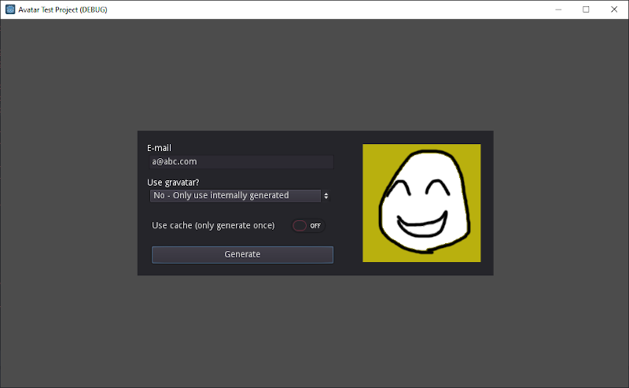
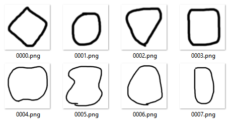
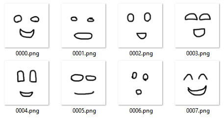
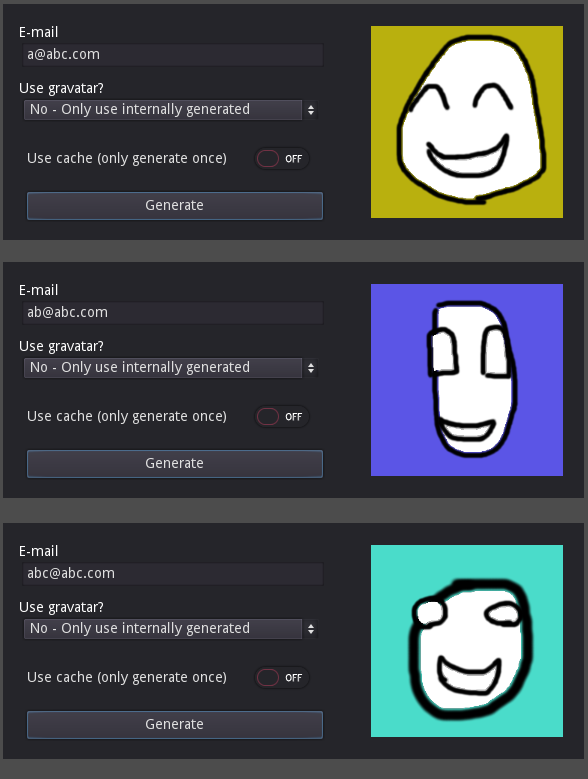
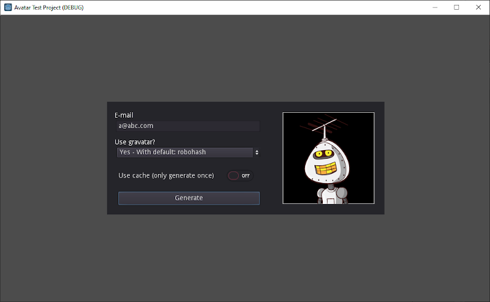
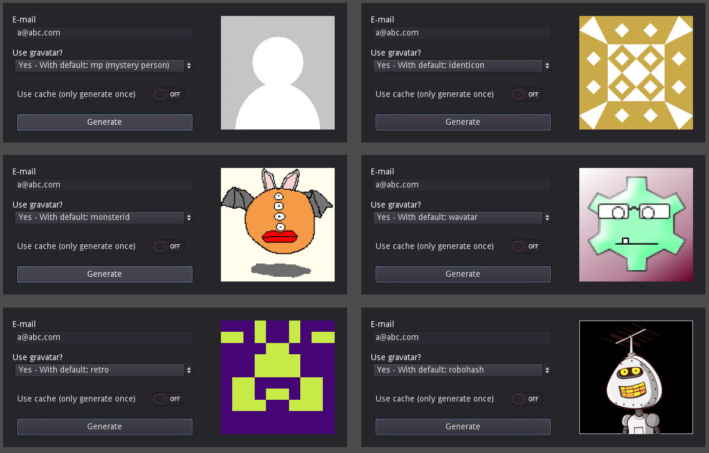

# GodotAvatarGenerator

This library for Godot generates a user profile picture based on an e-mail address, either retrieving from Gravatar (with several options for when a gravatar is not found) or generating internally.

Drop the Avatar node in your project or make it a singleton, and all you have to do at runtime is to call `get_avatar()` passing an e-mail address and a size. The e-mail will be hashed using md5 and this will be used as seed to build a generic but consistent profile picture - and *consistent* means the same e-mail always generates the same image.

The e-mail address doesn't have to exist. It doesn't even have to be a valid e-mail address.

## Internal generator

You can fully customize the style of the generated profiles so the drawings match the visual identity of your project. It is based on 2 sets of images: one for heads, and one for faces. Those are PNG images with transparent backgrounds, blended one on top of the other, in a colored background. For a given e-mail address there will be painted one background color, then one of the heads, and then one of the faces. By changing the PNG files you have total control over the style of the pictures.

The number of heads and faces is configurable via `export var` in the Avatar node, and can be any number up to 256 of each.

Below is the interface of the example project showing one avatar generated using the sample heads and faces included (featuring an artistic skill of the utmost level).

Contents of the `Heads` folder (replace those for your own images, unless you appreciate this peculiar style):

Contents of the `Faces` folder (replace those for your own images, unless you appreciate this peculiar style):

Three different avatars generated for different e-mail addresses:

## Gravatar

If you project has guaranteed access to internet, you can also use the Gravatar service (www.gravatar.com). Using this option, the script will first check if that e-mail address has a corresponding picture in Gravatar, and will download and use that one instead. Otherwise, you can specify what happens: using one of the default image generators from Gravatar, or falling back to the internal generator.

The default image generators from Gravatar, which can be used when the e-mail has no corresponding Gravatar picture in their database:

## Cache

Regardless of method, the avatar downloaded/generated is saved in a PNG file in a location in `user://` (configurable via `export var`). By default, if a picture was already generated for that e-mail by any method, any subsequent request will use that file instead of generating a new one (even if you change method). This can be disabled at any time, per call, forcing a new image to be produced for that e-mail address.